# Task 1 — Data Acquisition

## Requirement

> Download a subset of EM image data from at least **two** datasets available in the
> [OpenOrganelle repository](https://openorganelle.janelia.org/organelles/mito).
> All downloads must be performed programmatically (no manual downloads).

---

## Method

Data is downloaded via the [`download.py`](download.py) script (see [README](../README.md) for environment setup):

```bash
# Download all four datasets (scale s3, 10 slices each)
python download.py --all-mito --scale s3 --slices 10

# Or download a single dataset
python download.py --dataset jrc_hela-3 --scale s3 --slices 10
```

Four datasets were downloaded: `jrc_hela-3`, `jrc_cos7-11`, `jrc_mus-kidney`, `jrc_mus-liver`.

All `.npy` files are saved to `data/raw/`.

---

## Results

### Raw EM slices

| jrc_mus-kidney | jrc_mus-liver | jrc_hela-3 | jrc_cos7-11 |
|---|---|---|---|
| 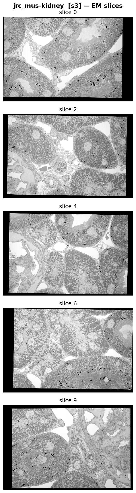 | 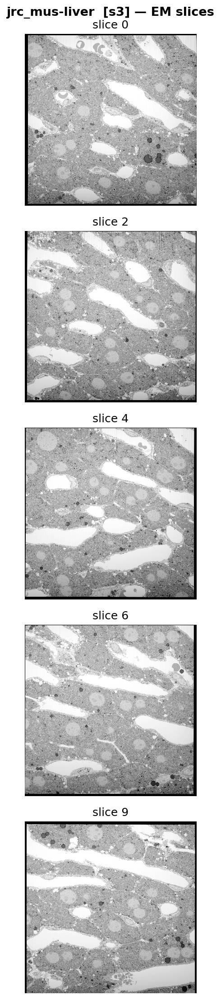 | 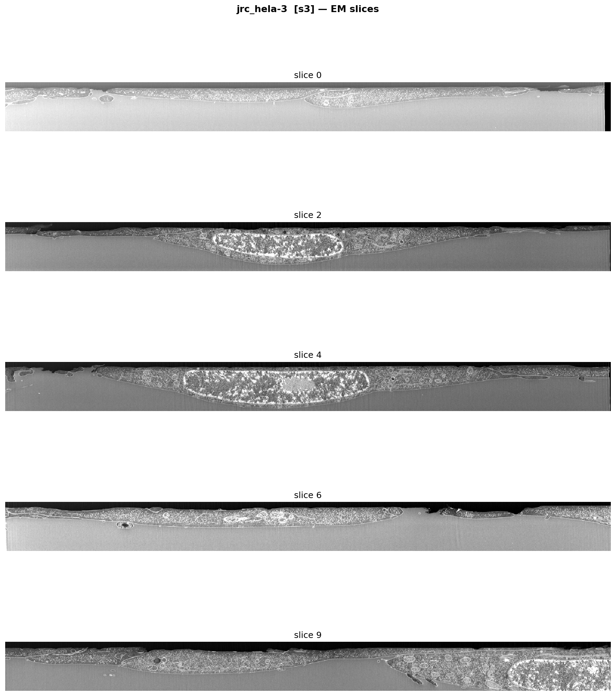 | 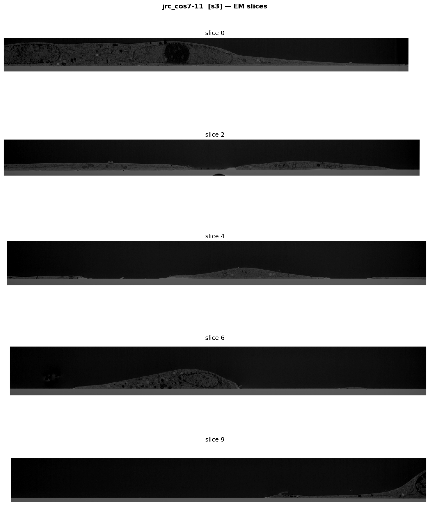 |

---

### Mitochondria segmentation masks

| jrc_mus-kidney | jrc_mus-liver | jrc_hela-3 | jrc_cos7-11 |
|---|---|---|---|
| 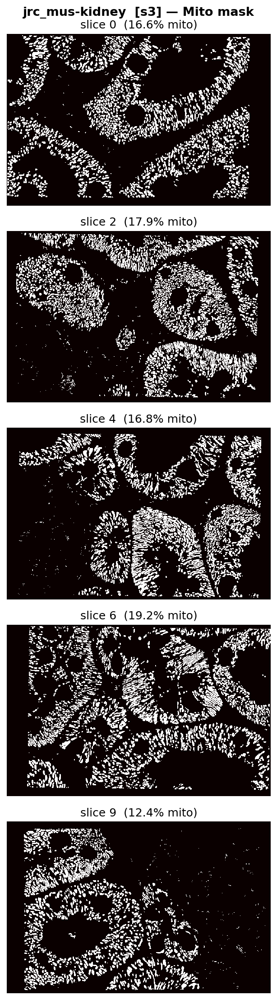 | 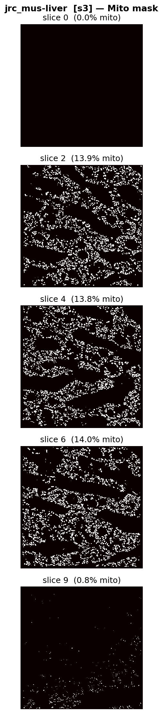 | 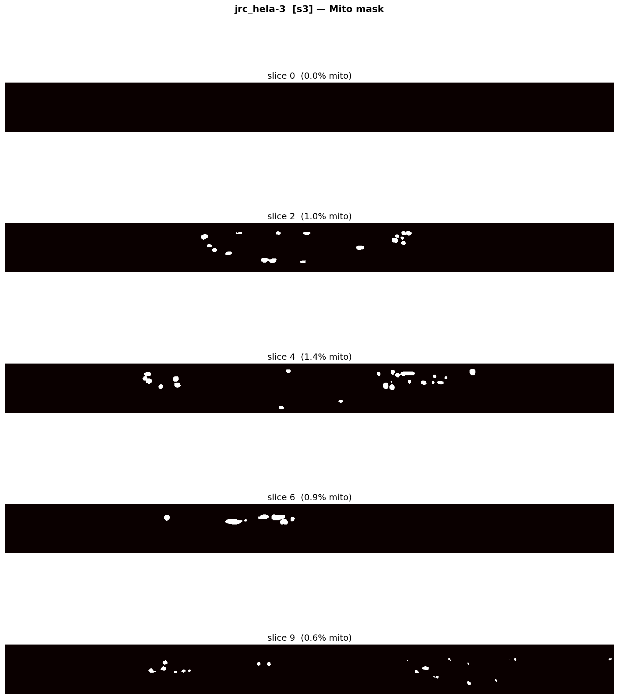 | 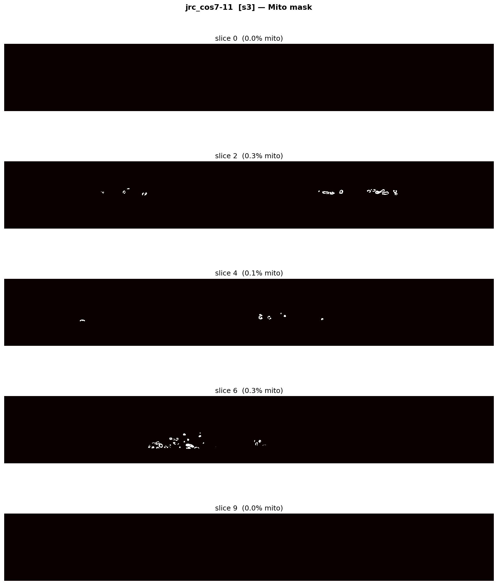 |

Mito coverage varies dramatically across datasets:

| Dataset | Mito coverage (typical slice) |
|---------|-------------------------------|
| `jrc_mus-kidney` | 12–19%|
| `jrc_mus-liver` | 13–14%|
| `jrc_hela-3` | 0.6–1.4% |
| `jrc_cos7-11` | 0–0.3% |

---

### EM + mitochondria overlay

| jrc_mus-kidney | jrc_mus-liver | jrc_hela-3 | jrc_cos7-11 |
|---|---|---|---|
| 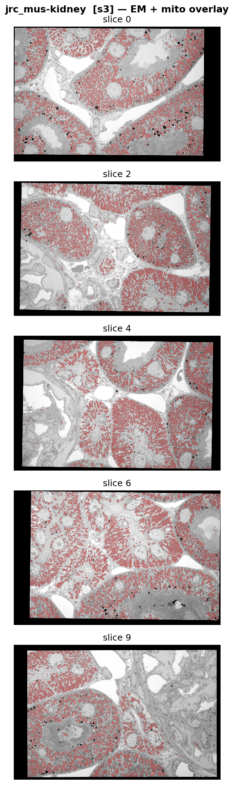 | 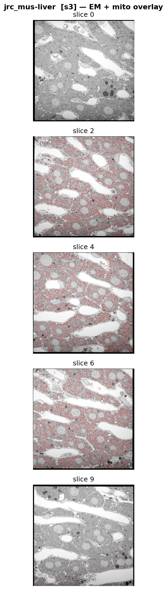 | 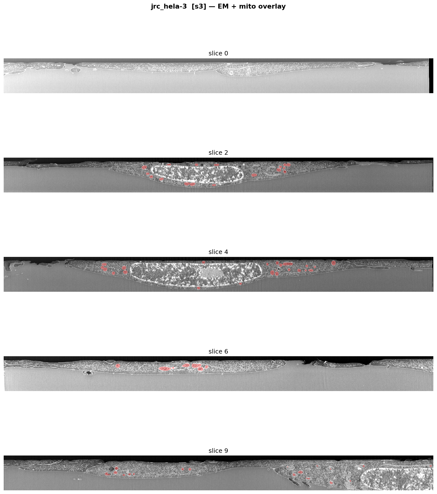 | 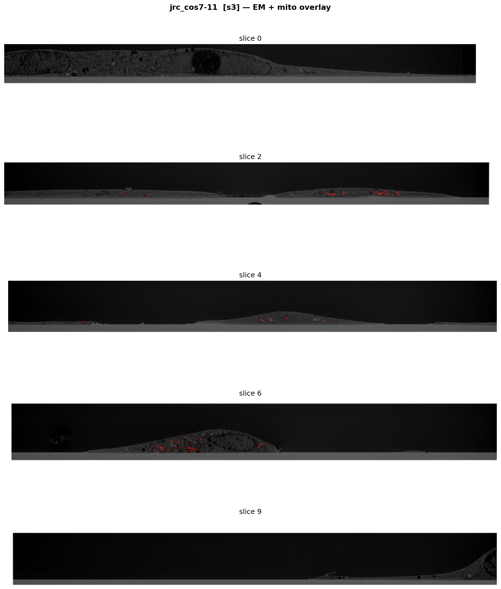 |

The overlays confirm tight correspondence between the EM ultrastructure and the
instance labels. In kidney and liver, the red overlay covers the majority of the
visible cytoplasm. In HeLa and COS-7, individual isolated mitochondria are
highlighted against mostly empty background.

---

### Mitochondria size distribution

| jrc_mus-kidney | jrc_mus-liver |
|---|---|
| 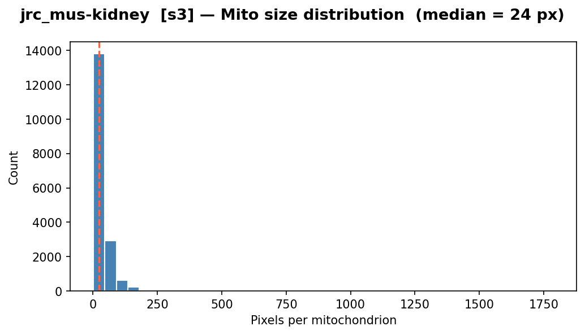 | 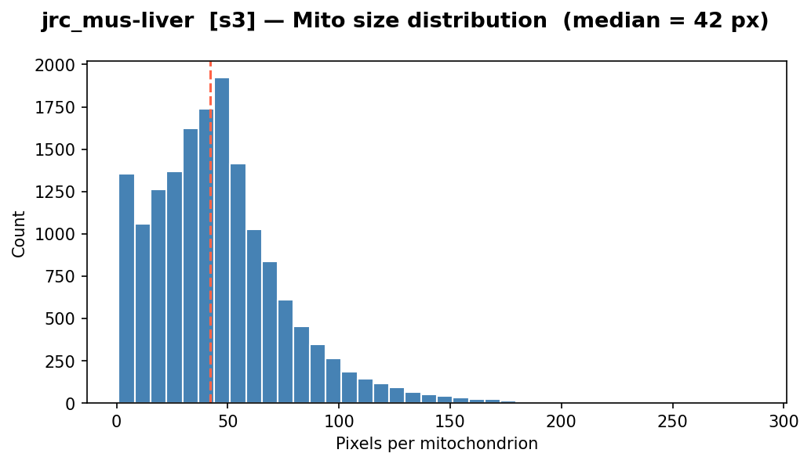 |

| jrc_hela-3 | jrc_cos7-11 |
|---|---|
| 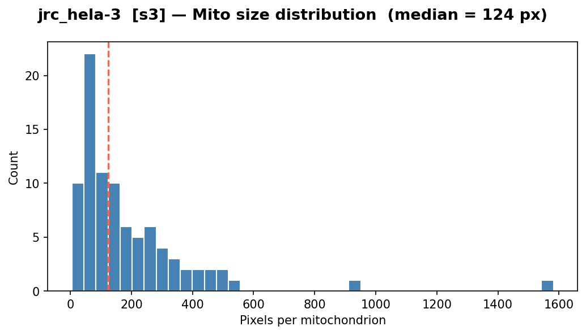 | 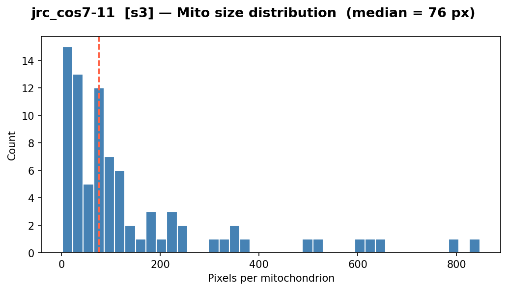 |

All four datasets show a right-skewed distribution on a linear scale.

| Dataset | Instance count | Size range (px) | Median (px) | Image size (px) |
|---------|----------------|-----------------|-------------|-----------------|
| `jrc_mus-kidney` | ~14 000 | 1 – 1 750 | 24 | 1535 × 997 |
| `jrc_mus-liver` | ~16 000 | 1 – 300 | 42 | 1593 × 1591 |
| `jrc_hela-3` | ~120 | 5 – 1 600 | 124 | 1550 × 125 |
| `jrc_cos7-11` | ~110 | 2 – 850 | 76 | 1094 × 150 |

Sizes are measured in pixels at scale s3, so values depend on imaging resolution, but serve as a reference for network patch design.
