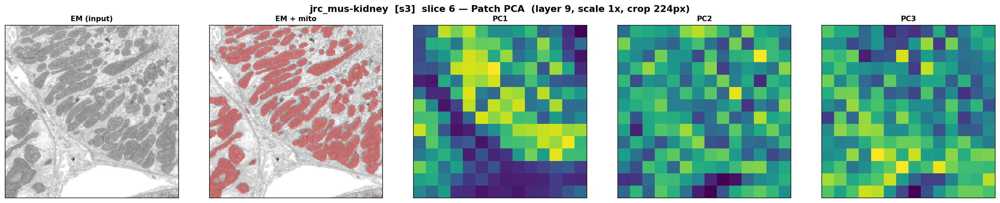
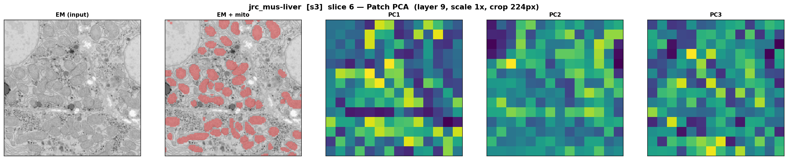
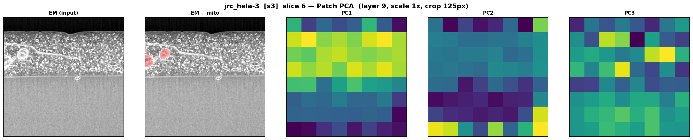
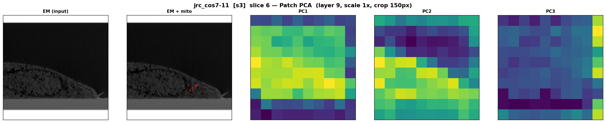
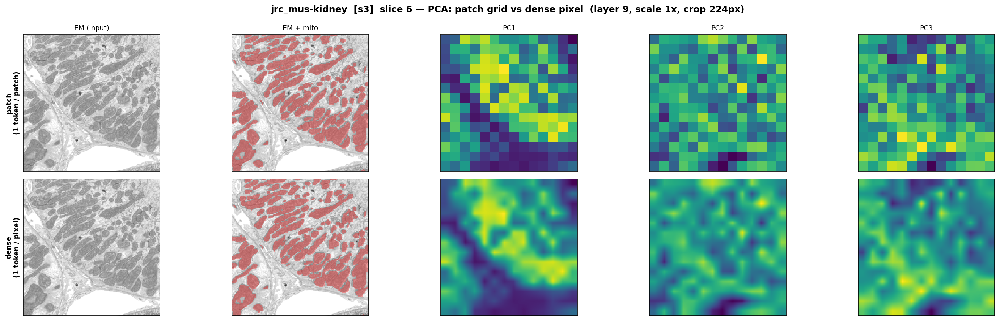
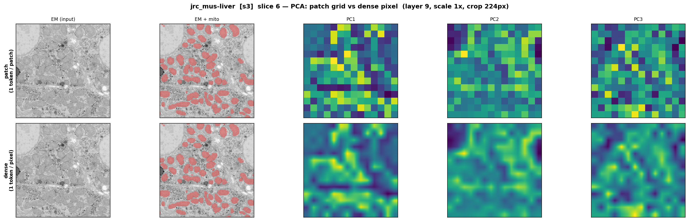
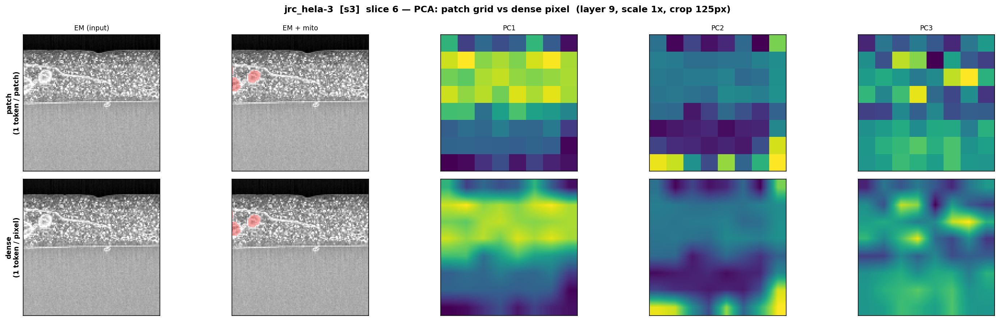
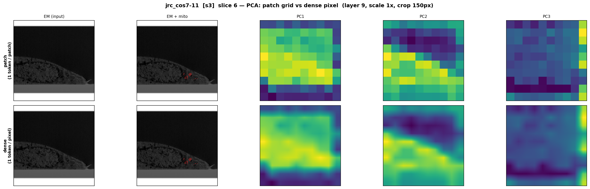

# Task 2 — Feature Extraction with 3

## Requirement

> 1. **Patch size selection:** Which patch size is best suited to capture mitochondrial
>    ultrastructure in the embeddings? Justify your choice.
> 2. **Dense embeddings:** Propose a method for obtaining dense, per-pixel embeddings
>    rather than per-patch embeddings. Implement it and compute dense embeddings for all datasets.

---

## Model & configuration

| Parameter | Value |
|-----------|-------|
| Model | `facebook/dinov3-vitb16-pretrain-lvd1689m` (ViT-B/16) |
| Model patch size | 16 px (fixed) |
| **Effective patch size** | **8 px** (via 2× input upsampling) |
| Layer extracted | Block 9 of 12 |
| Embedding dim | 768 |

---

## 1 — Patch size selection

The appropriate patch size should match the typical size of a mitochondrion in the images. Using `sqrt(median pixel count)` from Task 1 as the estimation of the size:

| Dataset | Median pixels | sqrt(median) |
|---------|--------------|--------------|
| `jrc_mus-kidney` | 24 | 4.9 px |
| `jrc_mus-liver` | 42 | 6.5 px |
| `jrc_hela-3` | 124 | 11.2 px |
| `jrc_cos7-11` | 76 | 8.7 px |

The typical mitochondrion spans **~5–11 px** at s3 resolution. An **8 px effective patch** matches this range well. Each token corresponds roughly to one mitochondrion, which is the right semantic granularity for organelle-level retrieval.

ViT-B/16 uses a fixed 16 px patch stride. An effective 8 px patch is achieved by **upsampling the input 2×** before feeding it to the model, with no model modification needed.

---

## 2 — Dense embeddings

DINO produces one embedding vector per patch, yielding a `(nh, nw, D)` grid. To obtain a dense `(H, W, D)` field, the patch grid is **bilinearly upsampled** to the full input resolution:

```python
# shared/utils.py
def upsample_patch_embeddings(patch_grid, target_h, target_w):
    t = torch.from_numpy(patch_grid).permute(2, 0, 1).unsqueeze(0).float()
    t = F.interpolate(t, size=(target_h, target_w), mode="bilinear", align_corners=False)
    return t.squeeze(0).permute(1, 2, 0).numpy()
```

Embeddings are extracted via `extract_embeddings.py` and saved as `.npz` files in `data/embeddings/`.

---

## Results

All figures show slice 6, layer 9 embeddings, scale 1×. Slices are center cropped to show more details, crop size is 224 px for kidney and liver; auto-clamped to 125 px (HeLa) and 150 px (COS-7).

### Patch-level PCA

To verify the embeddings capture structural information, PCA is fitted jointly on all 10 slices' patch embeddings, then projected per-slice. Each tile shows (left→right): EM | EM+mito overlay | PC1 | PC2 | PC3.

| jrc_mus-kidney | jrc_mus-liver |
|---|---|
|  |  |

| jrc_hela-3 | jrc_cos7-11 |
|---|---|
|  |  |

The PCs show clear spatial structure. PC1 captures coarse foreground/background separation, PC2 and PC3 encode finer organelle-level texture in the kidney and liver datasets. The blocky appearance reflects the 16 px patch grid.

---

### Patch grid vs dense (per-pixel) PCA

Top row: patch-level PCA. Bottom row: bilinearly upsampled pixel-level embeddings.

| jrc_mus-kidney | jrc_mus-liver |
|---|---|
|  |  |

| jrc_hela-3 | jrc_cos7-11 |
|---|---|
|  |  |

The dense maps recover smoother PCs that follow organelle boundaries rather than the rigid patch grid.
